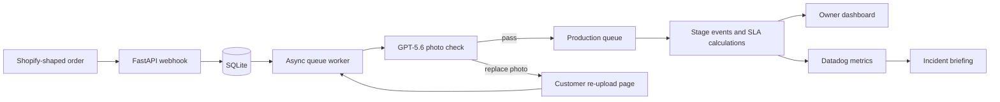

# Shopfloor

Shopify runs the storefront. Shopfloor runs what happens after the order.

Shopfloor is a production operating system for small makers selling personalized physical products. It receives Shopify-shaped orders, checks customer photos before anything is printed, gives the owner a one-tap production queue, and turns stage activity into clear operational signals.

**Track:** Work & productivity tools
**Live demo:** https://shopfloor-production-os.onrender.com/dashboard

## Why it exists

Small personalized-product businesses often manage production in a spreadsheet that cannot answer three basic questions reliably:

- What needs attention now?
- Which order should I work on next?
- Where is production slowing down?

Shopfloor connects the online order to the physical workflow without requiring a full manufacturing ERP.

## Demo flow

Create five Shopify-shaped sample orders:

```bash
curl -X POST 'https://shopfloor-production-os.onrender.com/simulate/orders?n=5'
```

Then open the [live production dashboard](https://shopfloor-production-os.onrender.com/dashboard). Sample photos intentionally include printable, blurry, low-resolution, and unsafe-crop cases.

The end-to-end path is:

1. A Shopify `orders/create` payload enters through a verified webhook.
2. The photo-quality gate checks sharpness, resolution, exposure, and crop risk.
3. Failed photos move to **On hold photo** with a plain-language customer message and secure re-upload link.
4. A valid replacement returns to the quality gate and releases the order.
5. The owner advances production through Ready to print, Printed, Pressed, and Shipped.
6. Shopfloor records every transition, calculates business-hour targets, and publishes owner-oriented Datadog metrics.

## What is implemented

- Real Shopify order payload parsing and HMAC verification, disabled only in explicit simulation mode
- GPT-5.6 vision quality gate for customer uploads
- Deterministic sample-photo inspection in simulation mode to make the public demo repeatable and cost-controlled
- Fail-closed behavior when AI inspection is unavailable: unknown photos remain pending and never silently pass
- Secure, expiring, single-use customer re-upload flow
- Server-rendered owner dashboard and one-tap production queue
- Order detail pages with production timeline and recommended action
- Customer photo reminders every 24 hours, with personal follow-up after three reminders
- Europe/Madrid business-hour service targets and seven-day production-cycle metrics
- Datadog stage counts, overdue work, oldest-stage age, production cycle, fulfillment, customer wait, delivery, and worker heartbeat
- Datadog alert webhook and three-sentence incident briefing grounded in current queue evidence
- ElevenLabs voice briefing recorded for each incident when a voice key is configured, playable directly from the dashboard banner or the incident page
- Reversible local chaos controls for demonstrating surge, latency, and worker failure; disabled on the public deployment

## AI usage

### Photo-quality inspection

For non-sample customer uploads, Shopfloor sends the image to GPT-5.6 and requests structured JSON containing a pass/fail verdict, concrete reasons, and a warm one-sentence customer explanation. The inspection is designed for a 50 mm printed product, not generic image aesthetics.

The application enforces `MAX_REAL_QC_CALLS` before making a request. If the provider or key is unavailable, the order remains visibly pending.

### Incident copilot

Datadog alerts are enriched with current order counts, the oldest open order, and recent structured application events. GPT-5.6 turns that evidence into exactly three sentences: what is happening, the likely cause, and the next action.

When an ElevenLabs key is configured, Shopfloor also records the briefing as spoken audio so the owner can listen instead of reading. Voice generation is real in every mode and fails soft: if synthesis is unavailable, the incident still opens as text.

Simulation mode uses deterministic incident briefing text so judges can exercise the workflow without consuming the project's API budget.

## Architecture



The stack stays deliberately small: Python 3.12, FastAPI, SQLAlchemy, SQLite, Jinja2, htmx, and an in-process asyncio worker. There is no JavaScript framework, task queue, or distributed database in the demo.

## Service targets

Manual production targets use Monday-Friday, 09:00-18:00 Europe/Madrid business time.

| Stage | Initial target |
|---|---:|
| Order received to first photo response | 2 elapsed minutes |
| Customer photo hold | Reminder every 24 elapsed hours |
| Ready to print | 6 business hours |
| Printed | 6 business hours |
| Pressed to handed to carrier | 12 business hours |
| Carrier delivery | 48 elapsed hours |
| Median production cycle | 24 business hours |

Production cycle ends when the order is handed to the carrier and excludes customer photo-wait time. Carrier delivery is measured separately.

## Run locally

```bash
python3.12 -m venv .venv
source .venv/bin/activate
python -m pip install -e '.[dev]'
cp .env.example .env
uvicorn app.main:app --reload
```

Open http://127.0.0.1:8000/dashboard and create sample orders:

```bash
curl -X POST 'http://127.0.0.1:8000/simulate/orders?n=5'
```

Run the tests:

```bash
python -m pytest -q
```

## Security and deployment

- `.env` is excluded from Git and `.env.example` contains names only.
- Shopify webhook signatures use constant-time HMAC comparison.
- Datadog webhook requests require a generated secret on the hosted deployment.
- Datadog, OpenAI, and ElevenLabs API keys are stored only in Render environment settings.
- Uploaded files are size-limited and verified as JPEG, PNG, or WebP content.
- Public chaos controls are disabled.
- The hosted instance contains synthetic customer data only and is intentionally unauthenticated for judging.

`render.yaml` provisions one Render service with a persistent disk. SQLite, uploads, and structured logs live under `/var/data`.

## Scope and roadmap

The demo is intentionally customer-zero and single-instance. See [ROADMAP.md](ROADMAP.md) for the next product steps, including optional personalization proofs and customer approval. A real deployment would add authentication, per-business configuration, managed storage/database services, carrier integration, and production messaging.

## Built with Codex

Codex was used throughout architecture review, implementation, adversarial testing, production hardening, deployment, and the owner-oriented Datadog redesign. See [CODEX-LOG.md](CODEX-LOG.md) for the build record and primary session ID.
